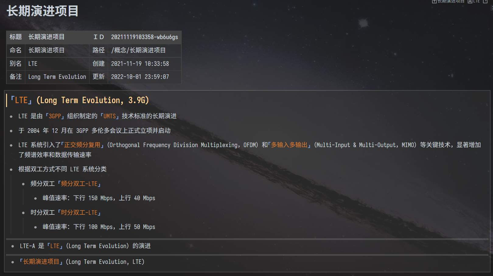

---

---
[简体中文](./README_zh_CN.md) \| English

---

# Miscellaneous Templates

A miscellaneous set of tool-like templates for Siyuan Note.

## PREVIEW

## INTRODUCTION

This set of templates consists of three types of templates.
- `Query`: query tools
  - This group of templates requires the widget of `Query` to be installed first.
  - [Zuoqiu-Yingyi/widget-query: **A** widget that renders the query results of the Siyuan Notes database in tabular style.](https://github.com/Zuoqiu-Yingyi/widget-query)
  - This group of templates primarily implements some query functions using `Query` widget.
- `Embed`: embed tools
  - This group of templates primarily implements some summarization functions using embeded block.
- `Other`: other tools
  - This group of templates primarily implements some other functions.

### INTRODUCTION TO EACH TEMPLATE

- `Query`
  - `查询今日更新的文档.md` | `query-updated-doc-today.md`
    - Summarize today's updated documents in tabular form (excluding the documents where the widget is located).
    - `00:00 ~ 现在` | `00:00 ~ Now`
  - `查询当前文档反链列表.md` | `query-backlink-list-of-doc.md`
    - Summarizes blocks referencing the current document in table.
  - `查询24小时内更新的文档.md` | `query-updated-doc-24H.md`
    - Summarize the updated documents within 24 hours in tabular form (excluding the documents where the widget is located).
  - `查询嵌入块反链.md` | `query-enbedded-blocks-breaklink.md`
    - Summarizes the embedded block of the embedded specified block in a table.
- `Embed`
  - `嵌入当前文档反链.md` | `embed-backlink-of-doc.md`
    - Summarize the backlink of the current document as an embedded block (all blocks that reference the current document).
- `Other`
  - `当前文档信息.md` | `doc-info.md`
    - Render the information of the current document in tabular form.
      - the title of the current document
      - the name of the current document
      - the alias of the current document
      - the memo of the current document
      - the ID of the current document
      - the path of the current document
      - the creation time of the current document
      - the update time of the current document
  - `webview.md`
    - Display web pages using the `<webview>` tag (desktop only).
    - For details, please refer to [`<webview>` Tag | Electron](https://www.electronjs.org/docs/latest/api/webview-tag).

## CHANGE LOG

[CHANGE LOG](./CHANGELOG.md)
