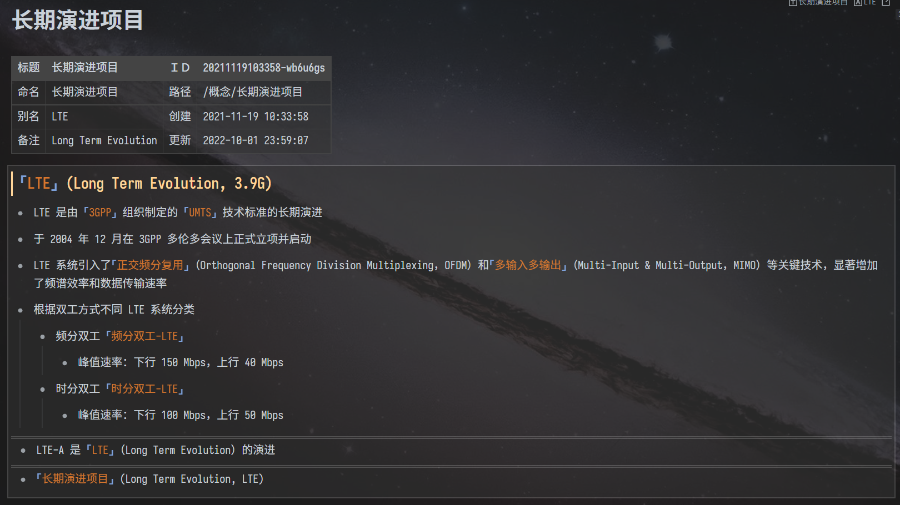

---

---
简体中文 \| [English](./README.md)

---

# 乱七八糟的模板

思源笔记的一套乱七八糟的工具类模板

## 预览

## 介绍

本套模板由三组模板组成
- `Query`: 查询工具
  - 该组模板需要首先安装 `Query` 挂件
  - [Zuoqiu-Yingyi/widget-query: 一个将思源笔记数据库查询结果以表格样式渲染的挂件](https://github.com/Zuoqiu-Yingyi/widget-query)
  - 该组模板主要使用 `Query` 挂件实现一些查询功能
- `Embed`: 嵌入工具
  - 该组模板主要使用嵌入块实现一些汇总功能
- `Other`: 其他工具
  - 该组模板主要实现其他功能

### 各模板介绍

- `Query`
  - `查询今日更新的文档.md` | `query-updated-doc-today.md`
    - 以表格的形式汇总今日更新的文档 (排除挂件所在的文档)
    - `00:00 ~ 现在` | `00:00 ~ Now`
  - `查询当前文档反链列表.md` | `query-backlink-list-of-doc.md`
    - 以表格的形式汇总引用当前文档的块
  - `查询24小时内更新的文档.md` | `query-updated-doc-24H.md`
    - 以表格的形式汇总 24 小时内更新的文档 (排除挂件所在的文档)
  - `查询嵌入块反链.md` | `query-enbedded-blocks-breaklink.md`
    - 以表格的形式汇总嵌入指定块的嵌入块
- `Embed`
  - `嵌入当前文档反链.md` | `embed-backlink-of-doc.md`
    - 以嵌入块的形式汇总当前文档的反链 (所有引用当前文档的块)
- `Other`
  - `当前文档信息.md` | `doc-info.md`
    - 以表格的形式生成当前文档的信息
      - 当前文档标题
      - 当前文档命名
      - 当前文档别名
      - 当前文档备注
      - 当前文档 ID
      - 当前文档路径
      - 当前文档创建时间
      - 当前表格更新时间
  - `webview.md`
    - 使用 `<webview>` 标签显示网页(仅限桌面端)
    - 详情请参考 [`<webview>` Tag | Electron](https://www.electronjs.org/zh/docs/latest/api/webview-tag)

## 更改日志

[CHANGE LOG](./CHANGELOG.md)
